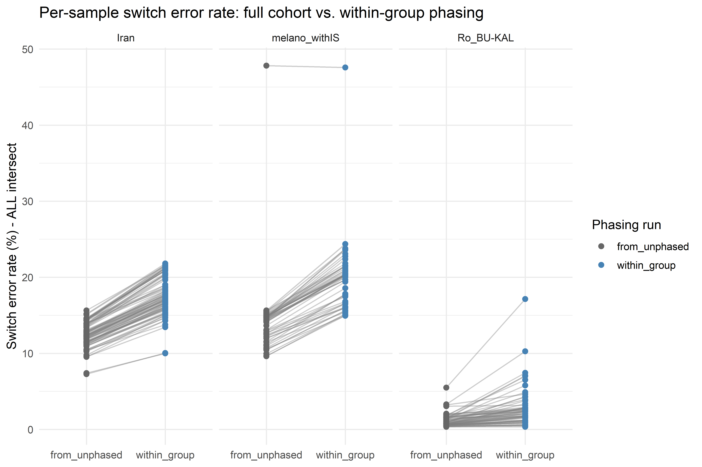
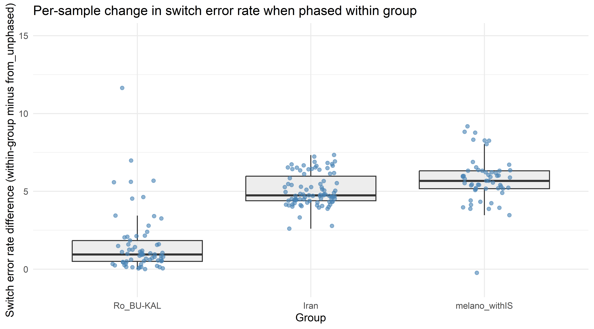
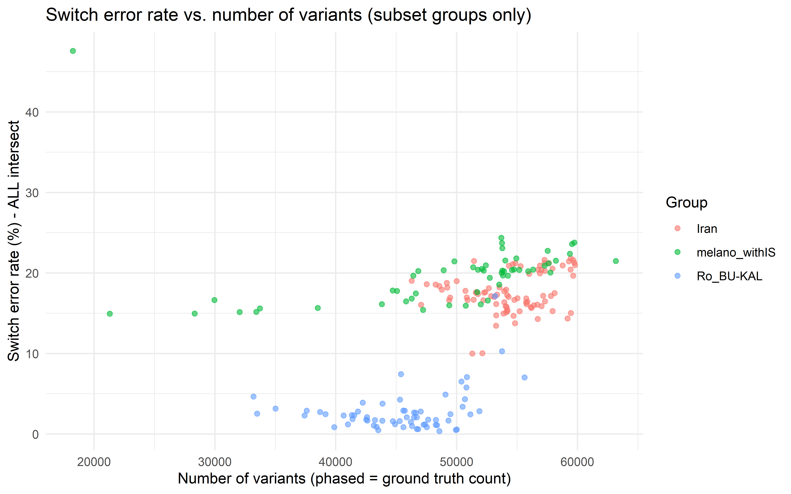

Switch Error Rates: Full Cohort vs. Within-Group Phasing
================
2026-07-17

## Load data

``` r
getwd()
```

    ## [1] "C:/Users/ldu/Documents/GitHub/Oenanthe_switch_errors"

``` r
df <- read.delim("combined_summary_all_groups.tsv", stringsAsFactors = FALSE)

df <- df %>%
  mutate(n_variants = phased_count)  # phased_count == ground_truth_count for every sample
str(df)
```

    ## 'data.frame':    585 obs. of  7 variables:
    ##  $ group                             : chr  "from_unphased" "from_unphased" "from_unphased" "from_unphased" ...
    ##  $ sample                            : chr  "2938_J-Garcia" "AZ-ALT-2021-006" "AZ-ALT-2021-007" "AZ-ALT-2021-008" ...
    ##  $ phased_count                      : int  46540 52476 56307 54409 48168 53346 52112 52408 53281 54892 ...
    ##  $ ground_truth_count                : int  46540 52476 56307 54409 48168 53346 52112 52408 53281 54892 ...
    ##  $ switch_error_rate_ALL_intersec    : num  28.12 10.03 9.31 10.64 9.82 ...
    ##  $ switch_error_rate_Largest_intersec: num  22.22 10.53 8.77 20.31 16.39 ...
    ##  $ n_variants                        : int  46540 52476 56307 54409 48168 53346 52112 52408 53281 54892 ...

``` r
df$group[which(df$group=="samples_iran")]<-"Iran"
df$group[which(df$group=="samples_melanoleuca")]<-"melano_withIS"
df$group[which(df$group=="samples_roandBUKAL")]<-"Ro_BU-KAL"

group_sizes <- df %>%
  count(group, name = "group_size")
df <- df %>%
  left_join(group_sizes, by = "group")
```

``` r
knitr::kable(group_sizes)
```

| group         | group_size |
|:--------------|-----------:|
| Iran          |         87 |
| Ro_BU-KAL     |         65 |
| from_unphased |        378 |
| melano_withIS |         55 |

## Pair each sample: from_unphased vs. its subset group

``` r
baseline <- df %>%
  filter(group == "from_unphased") %>%
  select(sample, switch_error_ALL_baseline = switch_error_rate_ALL_intersec)

subset_runs <- df %>%
  filter(group != "from_unphased") %>%
  select(sample, group, switch_error_ALL_subset = switch_error_rate_ALL_intersec)

paired <- subset_runs %>%
  inner_join(baseline, by = "sample") %>%
  mutate(difference = switch_error_ALL_subset - switch_error_ALL_baseline)

n_matched <- nrow(paired)
n_subset_total <- nrow(subset_runs)

paired %>% select(group, sample, switch_error_ALL_baseline, switch_error_ALL_subset, difference) %>%
  knitr::kable(digits = 3)
```

| group | sample | switch_error_ALL_baseline | switch_error_ALL_subset | difference |
|:---|:---|---:|---:|---:|
| Iran | IR-ARD-2018-001 | 13.91 | 21.24 | 7.33 |
| Iran | IR-ARD-2018-002 | 15.64 | 21.48 | 5.84 |
| Iran | IR-ARD-2018-003 | 14.51 | 20.89 | 6.38 |
| Iran | IR-ARD-2018-005 | 15.18 | 21.81 | 6.63 |
| Iran | IR-ARD-2018-006 | 13.60 | 20.27 | 6.67 |
| Iran | IR-ASH-2017-001 | 12.99 | 17.64 | 4.65 |
| Iran | IR-ASH-2017-002 | 12.41 | 16.69 | 4.28 |
| Iran | IR-ASH-2017-006 | 12.47 | 16.87 | 4.40 |
| Iran | IR-BAL-2017-001 | 12.38 | 17.78 | 5.40 |
| Iran | IR-BAL-2017-002 | 11.27 | 15.27 | 4.00 |
| Iran | IR-BAL-2017-003 | 13.38 | 19.04 | 5.66 |
| Iran | IR-BAL-2017-004 | 12.32 | 17.57 | 5.25 |
| Iran | IR-BAL-2017-005 | 11.37 | 16.84 | 5.47 |
| Iran | IR-BAL-2017-006 | 12.83 | 17.93 | 5.10 |
| Iran | IR-BAL-2017-008 | 7.26 | 10.04 | 2.78 |
| Iran | IR-BAL-2017-009 | 11.24 | 15.98 | 4.74 |
| Iran | IR-BAL-2017-010 | 11.97 | 16.48 | 4.51 |
| Iran | IR-BAL-2017-011 | 11.98 | 17.50 | 5.52 |
| Iran | IR-BAL-2017-013 | 10.94 | 15.27 | 4.33 |
| Iran | IR-BAL-2017-014 | 10.44 | 14.96 | 4.52 |
| Iran | IR-DAM-2017-001 | 12.34 | 16.66 | 4.32 |
| Iran | IR-DAM-2017-002 | 10.44 | 13.76 | 3.32 |
| Iran | IR-ESF-2017-001 | 14.32 | 18.37 | 4.05 |
| Iran | IR-ESF-2017-002 | 14.50 | 18.60 | 4.10 |
| Iran | IR-FIR-2018-001 | 11.64 | 15.88 | 4.24 |
| Iran | IR-FIR-2018-003 | 7.40 | 10.00 | 2.60 |
| Iran | IR-FIR-2018-004 | 10.51 | 14.67 | 4.16 |
| Iran | IR-FIR-2018-005 | 11.92 | 16.06 | 4.14 |
| Iran | IR-FIR-2018-006 | 12.36 | 17.03 | 4.67 |
| Iran | IR-FIR-2018-007 | 12.71 | 17.75 | 5.04 |
| Iran | IR-FIR-2018-009 | 11.43 | 16.13 | 4.70 |
| Iran | IR-FIR-2018-010 | 11.49 | 15.88 | 4.39 |
| Iran | IR-FIR-2018-011 | 10.27 | 14.74 | 4.47 |
| Iran | IR-FIR-2018-013 | 11.85 | 16.63 | 4.78 |
| Iran | IR-FIR-2018-014 | 12.92 | 18.21 | 5.29 |
| Iran | IR-FIR-2018-015 | 10.94 | 15.43 | 4.49 |
| Iran | IR-HAS-2018-002 | 15.10 | 21.63 | 6.53 |
| Iran | IR-HAS-2018-004 | 13.96 | 20.38 | 6.42 |
| Iran | IR-HAS-2018-005 | 14.62 | 21.44 | 6.82 |
| Iran | IR-HAS-2018-007 | 14.39 | 21.62 | 7.23 |
| Iran | IR-HAS-2018-009 | 14.34 | 21.23 | 6.89 |
| Iran | IR-KIL-2018-001 | 11.37 | 15.79 | 4.42 |
| Iran | IR-KIL-2018-003 | 12.33 | 17.16 | 4.83 |
| Iran | IR-KIL-2018-005 | 11.82 | 16.15 | 4.33 |
| Iran | IR-KIL-2018-006 | 11.62 | 15.76 | 4.14 |
| Iran | IR-KIL-2018-008 | 12.77 | 17.32 | 4.55 |
| Iran | IR-KIL-2018-009 | 12.26 | 16.97 | 4.71 |
| Iran | IR-KIL-2018-011 | 11.47 | 16.37 | 4.90 |
| Iran | IR-KIL-2018-012 | 12.12 | 16.62 | 4.50 |
| Iran | IR-KIL-2018-013 | 12.18 | 17.14 | 4.96 |
| Iran | IR-KIL-2018-015 | 12.05 | 17.18 | 5.13 |
| Iran | IR-KIL-2018-017 | 11.02 | 15.11 | 4.09 |
| Iran | IR-KIL-2018-018 | 10.33 | 14.29 | 3.96 |
| Iran | IR-KIL-2018-019 | 9.56 | 13.44 | 3.88 |
| Iran | IR-KIL-2018-021 | 11.09 | 16.36 | 5.27 |
| Iran | IR-QAZ-2018-001 | 14.51 | 20.85 | 6.34 |
| Iran | IR-QAZ-2018-002 | 13.54 | 19.67 | 6.13 |
| Iran | IR-QAZ-2018-003 | 13.84 | 19.95 | 6.11 |
| Iran | IR-QAZ-2018-004 | 13.41 | 19.90 | 6.49 |
| Iran | IR-QAZ-2018-006 | 13.79 | 20.43 | 6.64 |
| Iran | IR-QAZ-2018-007 | 13.66 | 20.41 | 6.75 |
| Iran | IR-QAZ-2018-009 | 14.56 | 20.97 | 6.41 |
| Iran | IR-QAZ-2018-010 | 14.37 | 20.54 | 6.17 |
| Iran | IR-QAZ-2018-012 | 14.49 | 20.93 | 6.44 |
| Iran | IR-QUC-2017-001 | 13.92 | 18.57 | 4.65 |
| Iran | IR-QUC-2017-002 | 13.97 | 18.76 | 4.79 |
| Iran | IR-QUC-2017-003 | 12.82 | 17.56 | 4.74 |
| Iran | IR-QUC-2017-004 | 13.92 | 18.19 | 4.27 |
| Iran | IR-QUC-2017-006 | 14.57 | 18.99 | 4.42 |
| Iran | IR-SHA-2017-002 | 12.64 | 18.11 | 5.47 |
| Iran | IR-SHA-2017-003 | 11.96 | 16.44 | 4.48 |
| Iran | IR-SHA-2017-004 | 12.22 | 17.02 | 4.80 |
| Iran | IR-SHA-2017-005 | 12.87 | 17.92 | 5.05 |
| Iran | IR-SHA-2017-009 | 13.10 | 17.63 | 4.53 |
| Iran | IR-SHA-2017-010 | 12.93 | 16.94 | 4.01 |
| Iran | IR-SHA-2017-011 | 11.18 | 15.24 | 4.06 |
| Iran | IR-SHA-2017-015 | 11.55 | 15.66 | 4.11 |
| Iran | IR-SHA-2017-016 | 12.54 | 17.25 | 4.71 |
| Iran | IR-SHA-2017-017 | 11.42 | 16.04 | 4.62 |
| Iran | IR-SHA-2017-019 | 12.14 | 16.62 | 4.48 |
| Iran | IR-TAB-2018-002 | 14.39 | 20.91 | 6.52 |
| Iran | IR-TAB-2018-006 | 14.30 | 21.22 | 6.92 |
| Iran | IR-TAB-2018-007 | 14.56 | 21.29 | 6.73 |
| Iran | IR-TAB-2018-008 | 14.56 | 21.09 | 6.53 |
| Iran | IR-TAB-2018-009 | 9.75 | 15.02 | 5.27 |
| Iran | IR-TAB-2018-010 | 9.53 | 14.34 | 4.81 |
| Iran | IR-TAN-2017-004 | 12.67 | 17.37 | 4.70 |
| melano_withIS | BA-TRE-2019-001 | 14.17 | 20.22 | 6.05 |
| melano_withIS | BA-TRE-2019-002 | 14.76 | 19.66 | 4.90 |
| melano_withIS | BA-TRE-2019-007 | 14.61 | 19.69 | 5.08 |
| melano_withIS | BA-TRE-2019-008 | 14.32 | 20.30 | 5.98 |
| melano_withIS | BA-TRE-2019-009 | 15.19 | 20.36 | 5.17 |
| melano_withIS | BA-TRE-2019-010 | 14.84 | 20.51 | 5.67 |
| melano_withIS | GR-ATT-2019-007 | 15.46 | 21.81 | 6.35 |
| melano_withIS | GR-ATT-2019-009 | 15.04 | 20.96 | 5.92 |
| melano_withIS | GR-BAN-2022-022 | 14.11 | 20.43 | 6.32 |
| melano_withIS | GR-BAN-2022-023 | 14.28 | 20.22 | 5.94 |
| melano_withIS | GR-CRE-2017-001 | 13.65 | 20.02 | 6.37 |
| melano_withIS | GR-CRE-2017-002 | 14.13 | 20.45 | 6.32 |
| melano_withIS | GR-DAD-2018-001 | 14.35 | 22.38 | 8.03 |
| melano_withIS | GR-DIS-2019-017 | 15.64 | 21.44 | 5.80 |
| melano_withIS | GR-DIS-2019-020 | 15.18 | 21.20 | 6.02 |
| melano_withIS | GR-EVV-2019-001 | 14.39 | 20.39 | 6.00 |
| melano_withIS | GR-EVV-2019-005 | 14.65 | 21.53 | 6.88 |
| melano_withIS | GR-GAL-2019-014-REF | 14.94 | 21.48 | 6.54 |
| melano_withIS | GR-GAL-2019-015 | 14.84 | 20.40 | 5.56 |
| melano_withIS | GR-LES-2017-002 | 14.50 | 22.76 | 8.26 |
| melano_withIS | GR-LES-2017-004 | 15.60 | 24.37 | 8.77 |
| melano_withIS | GR-LES-2017-005 | 14.77 | 23.08 | 8.31 |
| melano_withIS | GR-LES-2017-006 | 14.61 | 23.78 | 9.17 |
| melano_withIS | GR-LES-2017-007 | 15.46 | 23.71 | 8.25 |
| melano_withIS | GR-LES-2017-008 | 14.78 | 23.60 | 8.82 |
| melano_withIS | GR-Oenhismel_white | 14.73 | 20.91 | 6.18 |
| melano_withIS | GR-SAT-2019-023 | 15.32 | 21.54 | 6.22 |
| melano_withIS | IS-GAL-1963-011 | 10.45 | 15.66 | 5.21 |
| melano_withIS | IS-GOL-1967-005 | 9.62 | 15.15 | 5.53 |
| melano_withIS | IS-GOL-1967-006 | 10.46 | 15.60 | 5.14 |
| melano_withIS | IS-HER-1967-007 | 47.82 | 47.58 | -0.24 |
| melano_withIS | IS-HER-1969-008 | 10.98 | 16.65 | 5.67 |
| melano_withIS | IS-HER-1976-009 | 11.54 | 17.76 | 6.22 |
| melano_withIS | IS-HER-1979-010 | 11.12 | 17.83 | 6.71 |
| melano_withIS | IS-JUD-1935-001 | 10.61 | 14.94 | 4.33 |
| melano_withIS | IS-JUD-1961-002 | 9.94 | 15.17 | 5.23 |
| melano_withIS | IS-JUD-1963-004 | 9.66 | 14.97 | 5.31 |
| melano_withIS | IS-JUD-1988-003 | 10.71 | 16.12 | 5.41 |
| melano_withIS | IS-JUD-2012-005 | 13.09 | 19.41 | 6.32 |
| melano_withIS | IS-JUD-2012-006 | 12.59 | 18.57 | 5.98 |
| melano_withIS | IS-JUD-2012-007 | 12.23 | 17.63 | 5.40 |
| melano_withIS | IT-GRA-2019-001 | 12.01 | 15.98 | 3.97 |
| melano_withIS | IT-GRA-2019-002 | 12.70 | 16.57 | 3.87 |
| melano_withIS | IT-GRA-2019-003 | 11.98 | 16.11 | 4.13 |
| melano_withIS | IT-GRA-2019-006 | 12.23 | 16.47 | 4.24 |
| melano_withIS | IT-GRA-2019-007 | 12.94 | 16.82 | 3.88 |
| melano_withIS | IT-GRA-2019-009 | 12.47 | 15.94 | 3.47 |
| melano_withIS | IT-GRA-2019-010 | 11.48 | 15.42 | 3.94 |
| melano_withIS | IT-GRA-2019-012 | 13.05 | 17.46 | 4.41 |
| melano_withIS | MN-MUR-2019-004 | 14.61 | 20.05 | 5.44 |
| melano_withIS | MN-MUR-2019-010 | 15.03 | 20.23 | 5.20 |
| melano_withIS | MN-ULC-2019-011 | 14.92 | 20.35 | 5.43 |
| melano_withIS | MN-ULC-2019-014 | 14.84 | 20.72 | 5.88 |
| melano_withIS | MN-ULC-2019-015 | 14.50 | 19.67 | 5.17 |
| melano_withIS | MN-VIR-2019-002 | 14.93 | 20.31 | 5.38 |
| Ro_BU-KAL | BU-KAL-2019-001 | 1.76 | 7.44 | 5.68 |
| Ro_BU-KAL | BU-KAL-2019-002 | 1.32 | 1.86 | 0.54 |
| Ro_BU-KAL | BU-KAL-2019-003 | 0.98 | 3.38 | 2.40 |
| Ro_BU-KAL | BU-KAL-2019-004 | 0.59 | 1.64 | 1.05 |
| Ro_BU-KAL | BU-KAL-2019-005 | 1.88 | 6.51 | 4.63 |
| Ro_BU-KAL | BU-KAL-2019-006 | 1.42 | 2.08 | 0.66 |
| Ro_BU-KAL | BU-KAL-2019-007 | 0.86 | 2.46 | 1.60 |
| Ro_BU-KAL | BU-KAL-2019-008 | 0.71 | 2.79 | 2.08 |
| Ro_BU-KAL | BU-KAL-2019-009 | 0.59 | 2.08 | 1.49 |
| Ro_BU-KAL | BU-KAL-2019-010 | 0.73 | 1.06 | 0.33 |
| Ro_BU-KAL | BU-KAL-2019-011 | 1.30 | 2.09 | 0.79 |
| Ro_BU-KAL | BU-KAL-2019-012 | 0.79 | 2.91 | 2.12 |
| Ro_BU-KAL | BU-KAL-2019-013 | 0.73 | 2.32 | 1.59 |
| Ro_BU-KAL | BU-KAL-2019-014 | 1.53 | 2.63 | 1.10 |
| Ro_BU-KAL | BU-KAL-2019-015 | 1.62 | 2.80 | 1.18 |
| Ro_BU-KAL | BU-KAL-2019-016 | 0.63 | 1.49 | 0.86 |
| Ro_BU-KAL | BU-KAL-2019-017 | 0.49 | 0.61 | 0.12 |
| Ro_BU-KAL | BU-KAL-2019-018 | 1.48 | 7.06 | 5.58 |
| Ro_BU-KAL | BU-KAL-2019-019 | 0.69 | 1.61 | 0.92 |
| Ro_BU-KAL | BU-KAL-2019-020 | 0.81 | 2.06 | 1.25 |
| Ro_BU-KAL | BU-KAL-2019-021 | 3.23 | 4.65 | 1.42 |
| Ro_BU-KAL | RO-CHE-2017-001 | 1.94 | 2.73 | 0.79 |
| Ro_BU-KAL | RO-CHE-2017-002 | 3.05 | 3.16 | 0.11 |
| Ro_BU-KAL | RO-CHE-2019-004 | 1.08 | 1.21 | 0.13 |
| Ro_BU-KAL | RO-CHE-2019-005 | 1.59 | 1.73 | 0.14 |
| Ro_BU-KAL | RO-CHE-2019-006 | 1.69 | 2.30 | 0.61 |
| Ro_BU-KAL | RO-CHE-2019-008 | 3.30 | 10.27 | 6.97 |
| Ro_BU-KAL | RO-CHE-2019-009 | 1.60 | 2.47 | 0.87 |
| Ro_BU-KAL | RO-CHE-2022-030 | 1.20 | 2.45 | 1.25 |
| Ro_BU-KAL | RO-HAR-2021-001 | 0.74 | 1.80 | 1.06 |
| Ro_BU-KAL | RO-HAR-2021-002 | 1.01 | 4.26 | 3.25 |
| Ro_BU-KAL | RO-SIT-2019-010 | 2.07 | 2.53 | 0.46 |
| Ro_BU-KAL | RO-SIT-2019-011 | 1.75 | 3.90 | 2.15 |
| Ro_BU-KAL | RO-SIT-2019-012 | 1.15 | 1.67 | 0.52 |
| Ro_BU-KAL | RO-SIT-2019-014 | 1.87 | 2.30 | 0.43 |
| Ro_BU-KAL | RO-SIT-2019-015 | 1.96 | 2.90 | 0.94 |
| Ro_BU-KAL | RO-SIT-2021-001 | 0.69 | 1.67 | 0.98 |
| Ro_BU-KAL | RO-SIT-2021-002 | 0.59 | 0.84 | 0.25 |
| Ro_BU-KAL | RO-SIT-2021-003 | 0.49 | 1.20 | 0.71 |
| Ro_BU-KAL | RO-SIT-2021-004 | 0.55 | 0.90 | 0.35 |
| Ro_BU-KAL | RO-SIT-2021-005 | 0.47 | 0.51 | 0.04 |
| Ro_BU-KAL | RO-SIT-2021-006 | 0.63 | 1.58 | 0.95 |
| Ro_BU-KAL | RO-SIT-2021-007 | 0.86 | 2.90 | 2.04 |
| Ro_BU-KAL | RO-SIT-2021-008 | 0.35 | 0.35 | 0.00 |
| Ro_BU-KAL | RO-SIT-2021-009 | 0.78 | 2.34 | 1.56 |
| Ro_BU-KAL | RO-SIT-2021-010 | 0.35 | 0.56 | 0.21 |
| Ro_BU-KAL | RO-SIT-2021-011 | 0.69 | 1.19 | 0.50 |
| Ro_BU-KAL | RO-SIT-2021-012 | 0.40 | 1.00 | 0.60 |
| Ro_BU-KAL | RO-SIT-2021-013 | 0.58 | 1.09 | 0.51 |
| Ro_BU-KAL | RO-SIT-2021-014 | 1.49 | 4.89 | 3.40 |
| Ro_BU-KAL | RO-SIT-2021-015 | 0.59 | 1.14 | 0.55 |
| Ro_BU-KAL | RO-SIT-2021-016 | 0.98 | 3.77 | 2.79 |
| Ro_BU-KAL | RO-SIT-2021-017 | 0.53 | 0.84 | 0.31 |
| Ro_BU-KAL | RO-SIT-2021-018 | 0.99 | 2.83 | 1.84 |
| Ro_BU-KAL | RO-SIT-2021-019 | 0.73 | 1.75 | 1.02 |
| Ro_BU-KAL | RO-SIT-2021-020 | 0.43 | 0.48 | 0.05 |
| Ro_BU-KAL | RO-SIT-2021-021 | 0.39 | 0.63 | 0.24 |
| Ro_BU-KAL | RO-SIT-2021-022 | 0.83 | 1.80 | 0.97 |
| Ro_BU-KAL | RO-SIT-2021-023 | 0.72 | 0.86 | 0.14 |
| Ro_BU-KAL | RO-SIT-2021-024 | 1.25 | 5.78 | 4.53 |
| Ro_BU-KAL | RO-SIT-2021-025 | 1.41 | 7.02 | 5.61 |
| Ro_BU-KAL | RO-SIT-2022-014 | 0.49 | 1.16 | 0.67 |
| Ro_BU-KAL | RO-SIT-2022-027 | 0.88 | 4.32 | 3.44 |
| Ro_BU-KAL | RO-SOM-2019-001 | 5.50 | 17.14 | 11.64 |
| Ro_BU-KAL | RO-TUR-2019-002 | 1.55 | 2.67 | 1.12 |

207 of 207 subset-group samples had a matching `from_unphased` entry and
are used in the comparisons below. A negative `difference` means switch
error was *lower* when phased within the subset group (i.e. subsetting
helped that individual); positive means phasing jointly with the full
cohort (`from_unphased`) was better for that individual.

## 1. Paired switch error rate, per sample

``` r
plot_long <- paired %>%
  select(sample, group, from_unphased = switch_error_ALL_baseline, within_group = switch_error_ALL_subset) %>%
  tidyr::pivot_longer(cols = c(from_unphased, within_group),
                       names_to = "phasing_run", values_to = "switch_error_rate_ALL_intersec")

ggplot(plot_long, aes(x = phasing_run, y = switch_error_rate_ALL_intersec, group = sample)) +
  geom_line(alpha = 0.4, color = "grey50") +
  geom_point(aes(color = phasing_run), size = 2) +
  facet_wrap(~ group, scales = "free_x") +
  scale_color_manual(values = c("from_unphased" = "grey40", "within_group" = "steelblue")) +
  labs(x = NULL, y = "Switch error rate (%) - ALL intersect",
       title = "Per-sample switch error rate: full cohort vs. within-group phasing",
       color = "Phasing run") +
  theme_minimal(base_size = 12)
```



The wild sample is samples_melanoleuca IS-HER-1967-007 18245 18245 47.58
43.75

## 2. Paired test, per group

Paired Wilcoxon signed-rank test (each sample is its own control here,
so a paired test has more power than comparing the two groups as
independent samples).

``` r
paired_tests <- paired %>%
  group_by(group) %>%
  summarise(
    n = n(),
    overall_phasing_medianb = median(switch_error_ALL_baseline),
    within_group_phasing_median = median(switch_error_ALL_subset),
    median_difference = median(difference)
  
    )

knitr::kable(paired_tests, digits = 3)
```

| group | n | overall_phasing_medianb | within_group_phasing_median | median_difference |
|:---|---:|---:|---:|---:|
| Iran | 87 | 12.41 | 17.25 | 4.74 |
| Ro_BU-KAL | 65 | 0.86 | 2.09 | 0.95 |
| melano_withIS | 55 | 14.35 | 20.22 | 5.67 |

**Interpretation:** `median_difference` = within-group minus
from_unphased. A

## 3. Distribution of per-sample differences

``` r
ggplot(paired, aes(x = reorder(group, difference, FUN = median), y = difference)) +
ylim(-1,15)+
geom_boxplot(outlier.shape = NA, fill = "grey90", alpha = 0.7) +
  geom_jitter(width = 0.15, alpha = 0.6, color = "steelblue") +
  labs(x = "Group", y = "Switch error rate difference (within-group minus from_unphased)",
       title = "Per-sample change in switch error rate when phased within group") +
  theme_minimal(base_size = 12)
```



**Interpretation:** Compare `median_difference` here to
`median_difference` in section 2 (switch error). If a group shows both
more variants *and* lower switch error within-group, that’s stronger
evidence subsetting helped for reasons beyond just variant count —
e.g. genetic homogeneity improving the phasing HMM, not merely having
more sites to work with.

## 5. Switch error rate vs. number of variants, by group

``` r
 ggplot(df %>% filter(group != "from_unphased"),
       aes(x = n_variants, y = switch_error_rate_ALL_intersec, color = group)) +
  geom_point(alpha = 0.6) +
  labs(x = "Number of variants (phased = ground truth count)",
       y = "Switch error rate (%) - ALL intersect",
       title = "Switch error rate vs. number of variants (subset groups only)",
       color = "Group") +
  theme_minimal()
```


